##简介：

&emsp;&emsp;由于之前在项目中使用到RecyclerView的时候只做了简单的学习，以满足项目需求，最近得空将RecyclerView相关知识整理整理，发表此篇文章仅作为个人知识梳理，也希望能帮助到需要的人。

&emsp;&emsp;RecyclerView用于在有限的窗口展现大量的数据，相比ListView、GridView，RecyclerView标准化了ViewHolder，而且用法非常的灵活，可以实现很多ListView实现不了的样式和功能，接下来我们通过示例逐步探索RecyclerView的各种使用。

##1、快速上手

①、在`build.gradle`中引入RecyclerView:
```xml
implementation 'com.android.support:recyclerview-v7:26.1.0'
```

②、布局文件
```xml
<LinearLayout xmlns:android="http://schemas.android.com/apk/res/android"
    android:layout_width="match_parent"
    android:layout_height="match_parent"
    android:orientation="vertical">
    <android.support.v7.widget.RecyclerView
        android:id="@+id/recyclerView"
        android:layout_width="match_parent"
        android:layout_height="match_parent"/>
</LinearLayout>
```

③、设置布局管理器和adapter
```Java
// 设置布局管理器
RecyclerView.LayoutManager mLayoutManager = new LinearLayoutManager(this,
        LinearLayoutManager.VERTICAL, false);
recyclerView.setLayoutManager(mLayoutManager);
// 设置adapter
adapter = new CommandRecyclerAdapter<String>(this, R.layout.item_vertical, dataList) {
    @Override
    public void convert(ViewHolder holder, String str) {
        holder.setText(R.id.tv_item, str);
    }
    @Override
    public void onItemClick(String str, int position) {
    }
};
recyclerView.setAdapter(adapter);
 //③. 设置Item之间间隔样式
recyclerView.addItemDecoration(new DividerItemDecoration(this, LinearLayoutManager.VERTICAL));
```

④、效果展示
&emsp;&emsp;&emsp;&emsp;&emsp;&emsp;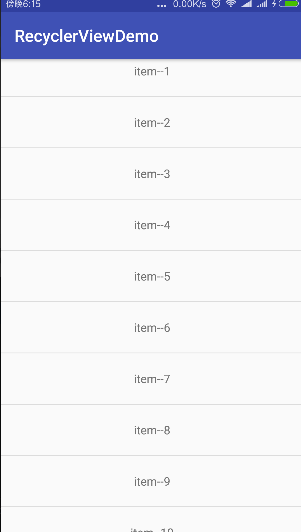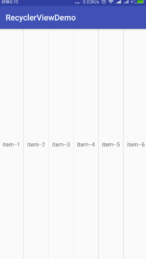

##2、通用Adapter && 点击事件

&emsp;&emsp;在上面的示例中，我们只需要3步就能从无到有的将RecyclerView展示出来，但实际上并没有那么简单，上面使用的Adapter是通过封装后的一个通用的Adapter，能适用于日常开发绝大多数的要求，下面我们看看里面的结构是怎样的。

&emsp;&emsp;在此之前，我们先对比一下之前我们使用的Adapter（比如ListView的），创建Adapter时，需要重写几个重要的方法：getCount()、getView()...，通常说到优化就是使用ViewHolder，但是这并不是强制的，如果不用也可以，那就每次都findView去。RecyclerView中规范了ViewHolder，变成了强制性的，在RecyclerView.Adapter的onBindViewHolder(ViewHolder holder, int position)方法中（相当于ListView Adapter的getView()方法），ViewHolder作为参数传递过来，绑定数据时就必须使用此viewHolder对象了。

&emsp;&emsp;那说到底ViewHolder到底是个什么东西呢？它是用来维护Item中控件的引用的，如果复用Item，就能避免很多findView的操作从而优化内存开销，RecyclerView之所以这样，就是为了规范化这个东西，说到底ViewHolder就是一个简单的类，里面维护了item控件的引用。

&emsp;&emsp;Adapter是个什么东西就不用说了吧？数据适配器，告诉RecyclerView有多少个条目，然后给每个条目绑定数据。值得注意的是RecyclerView并没有暴露Item的点击事件，我们可以在绑定数据的时候为Item设置点击和长点击事件。

下面看看相关代码：
```Java
public class ViewHolder extends RecyclerView.ViewHolder {
    private SparseArray<View> mViews;   //用于维护item中子控件的引用
    private View mConvertView;
    private Context mContext;

    public ViewHolder(Context context, View itemView, ViewGroup parent) {
        super(itemView);
        mContext = context;
        mConvertView = itemView;
        mViews = new SparseArray<>();
    }

    /**根据item布局id创建一个ViewHolder，Adapter中调用*/
    public static ViewHolder get(Context context, ViewGroup parent, int layoutId) {
        View itemView = LayoutInflater.from(context).inflate(layoutId, parent, false);
        ViewHolder holder = new ViewHolder(context, itemView, parent);
        return holder;
    }

    /**
     * 通过viewId获取控件
     * @param viewId
     * @return
     */
    private <T extends View> T getView(int viewId) {
        View view = mViews.get(viewId);
        if (view == null) {
            view = mConvertView.findViewById(viewId);
            mViews.put(viewId, view);
        }
        return (T) view;
    }

    /**为条目或者指定控件设置点击和长点击事件，在adapter中调用*/
    public ViewHolder setOnClickListener(int viewId,  View.OnClickListener listener) {
        if(viewId==-1){
            mConvertView.setOnClickListener(listener);
        }else{
            View view = getView(viewId);
            view.setOnClickListener(listener);
        }
        return this;
    }
    public ViewHolder setOnLongClickListener(int viewId,  View.OnLongClickListener listener) {
        if(viewId==-1){
            mConvertView.setOnLongClickListener(listener);
        }else{
            View view = getView(viewId);
            view.setOnLongClickListener(listener);
        }
        return this;
    }

    /**下面的方法暴露出去，用于绑定数据，如果不够用可以扩充*/

    public ViewHolder setVisible(int viewId, int visible) {
        getView(viewId).setVisibility(visible);
        return this;
    }
    public ViewHolder setTextColor(int viewId, int color) {
        TextView tv = getView(viewId);
        tv.setTextColor(color);
        return this;
    }
    public ViewHolder setText(int viewId, CharSequence text) {
        TextView tv = getView(viewId);
        tv.setText(text);
        return this;
    }
    @SuppressLint("NewApi")
    public ViewHolder setBackgroundResource(int viewId, int id) {
        View view = getView(viewId);
        if(0==id)
            view.setBackground(null);
        else
            view.setBackgroundResource(id);
        return this;
    }
    public ViewHolder setImageResource(int viewId, int resId) {
        ImageView view = getView(viewId);
        view.setImageResource(resId);
        return this;
    }
    public ViewHolder setCheckBoxChecked(int viewId, boolean check) {
        CheckBox cb = getView(viewId);
        cb.setChecked(check);
        return this;
    }
    public ViewHolder setLinearLayoutBgIcon(int viewId, int  iconResourse) {
        LinearLayout ll = getView(viewId);
        ll.setBackgroundResource(iconResourse);
        return this;
    }

}
```

```Java
public abstract class CommandRecyclerAdapter<T> extends RecyclerView.Adapter<ViewHolder> {
    protected Context mContext;
    protected int mLayoutId;
    protected List<T> mDatas;
    protected LayoutInflater mInflater;

    public CommandRecyclerAdapter(Context context, int layoutId, List<T> datas) {
        mDatas = new ArrayList<>();
        mContext = context;
        mInflater = LayoutInflater.from(context);
        mLayoutId = layoutId;
        if(datas!=null)
            mDatas.addAll(datas);
    }

    /**Adapter最重要的三个方法getItemCount()、onCreateViewHolder()、onBindViewHolder()*/
    @Override
    public int getItemCount(){
        return mDatas.size();
    }
    @Override
    public ViewHolder onCreateViewHolder(final ViewGroup parent, int viewType){
        ViewHolder viewHolder = ViewHolder.get(mContext, parent, mLayoutId);
        return viewHolder;
    }
    @Override
    public void onBindViewHolder(ViewHolder holder, final int position) {
        convert(holder, mDatas.get(position));
        /**为item设置点击和长点击事件*/
        holder.setOnClickListener(-1, new View.OnClickListener() {
            @Override
            public void onClick(View v) {
                onItemClick(mDatas.get(position), position);
            }
        });
        holder.setOnLongClickListener(-1, new View.OnLongClickListener() {
            @Override
            public boolean onLongClick(View v) {
                return onItemLongClick(mDatas.get(position), position);
            }
        });
    }

    /**数据设置、添加、删除相关方法*/
    public void setData(List<T> datas){
        mDatas.clear();
        if(datas!=null)
            mDatas.addAll(datas);
        notifyDataSetChanged();
    }
    public void addData(int position,T t){
        if(null!=mDatas)
            mDatas.add(position, t);
        notifyItemRemoved(position);
    }
    public void addDatas(int position, List<T> datas){
        if(datas!=null)
            mDatas.addAll(position, datas);
        notifyItemRemoved(position);
    }
    public void removeData(int position){
        if(null!=mDatas && mDatas.size()>position) {
            mDatas.remove(position);
            notifyItemRemoved(position);
        }
    }
    public void removeDatas(List<Integer> positions){
        if(null!=mDatas){
            for(int position:positions){
                if(mDatas.size()>position) {
                    mDatas.remove(position);
                    notifyItemRemoved(position);
                }
            }
        }
    }

    /**重写此方法，将数据绑定到控件上*/
    public abstract void convert(ViewHolder holder, T t);
    /**item点击和长点击事件*/
    public abstract void onItemClick(T data, int position);
    public boolean onItemLongClick(T data, int position){
        return true;
    }
}
```

**使用方法**：

&emsp;&emsp;创建adapter时，需要传入Context、item布局id、数据集合，然后实现convert()、onItemClick()方法，convert()方法用来为item控件绑定数据，拿着holder就能获取到item中的所有控件对象，而item点击事件使用还是非常多的，所以抽象了一下，使用时必须实现；相比长点击事件就使用没那么多，如果要为item设置长点击事件，就重写onItemLongClick()方法即可。数据类型可以是任意Object的子类，这样就能使用各种数据类型的绑定。

```Java
adapter = new CommandRecyclerAdapter<String>
        (this, R.layout.item_vertical, dataList) {
    @Override
    public void convert(ViewHolder holder, String str) {
        holder.setText(R.id.tv_item, str);
    }
    @Override
    public void onItemClick(String str, int position) {
    }
    @Override
    public boolean onItemLongClick(String data, int position) {
        return super.onItemLongClick(data, position);
    }
};
recyclerView.setAdapter(adapter);
```


##3、间隔样式ItemDecoration
&emsp;&emsp;上面的效果看起来非常不和谐，整个一大块，老的ListView可以设置divider属性就能将item之间隔开，而RecyclerView并没有提供divider属性，因为它的间隔样式更加灵活，需要我们自己去实现。

&emsp;&emsp;添加间隔样式使用`recyclerView.addItemDecoration(RecyclerView.ItemDecoration)`，传递一个`RecyclerView.ItemDecoration`的子类，RecyclerView提供了默认的实现类`DividerItemDecoration`，我们看看效果：

```Java
//③. 设置Item之间间隔样式
recyclerView.addItemDecoration(new DividerItemDecoration(this, LinearLayoutManager.VERTICAL));
```
&emsp;&emsp;&emsp;&emsp;&emsp;&emsp;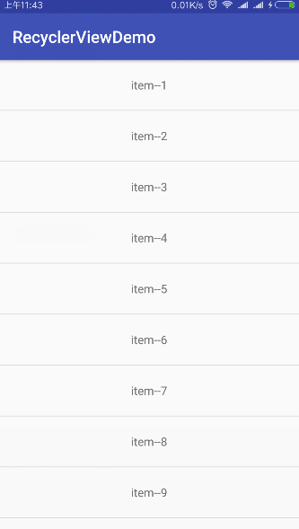


&emsp;&emsp;默认的间隔样式的实现就是一条分割线，这条分割线的高度、颜色是不能设置的，查看DividerItemDecoration的源码，发现绘制分割线的高度和颜色是从一个android.R.attr.listDivider的属性中获取的，RecyclerView并没有提供这个属性，所以可以想象使用的是系统默认的属性值。其实一条分割线在绝大多数的场景中已经足够使用，但如果我们有其他的需求（分割线高度或者颜色变一下）怎么办呢？那就实现RecyclerView.ItemDecoration，定义自己的间隔样式，ItemDecoration不是一个抽象类，默认的实现都是空，所以直接使用是没有任何效果的。

&emsp;&emsp;首先我们看看RecyclerView.ItemDecoration中都有那些方法，分别有什么用途：

###3.1.getItemOffsets()

&emsp;&emsp;这个方法用于设置item的偏移量，偏移的部分用于填充间隔样式。跟踪源码RecyclerView中只有有一个`getItemDecorInsetsForChild()`方法调用了`getItemOffsets()`，而`getItemDecorInsetsForChild()`方法返回了一个insets，这里面包含了所有item的间隔的left、top、right、bottom
之和：

```Java
Rect getItemDecorInsetsForChild(View child) {
    ...
    final Rect insets = lp.mDecorInsets;
    insets.set(0, 0, 0, 0);
    final int decorCount = mItemDecorations.size();
    for (int i = 0; i < decorCount; i++) {
        mTempRect.set(0, 0, 0, 0);
        mItemDecorations.get(i).getItemOffsets(mTempRect, child, this, mState);
        insets.left += mTempRect.left;
        insets.top += mTempRect.top;
        insets.right += mTempRect.right;
        insets.bottom += mTempRect.bottom;
    }
    lp.mInsetsDirty = false;
    return insets;
}
```

&emsp;&emsp;&emsp;&emsp;&emsp;&emsp;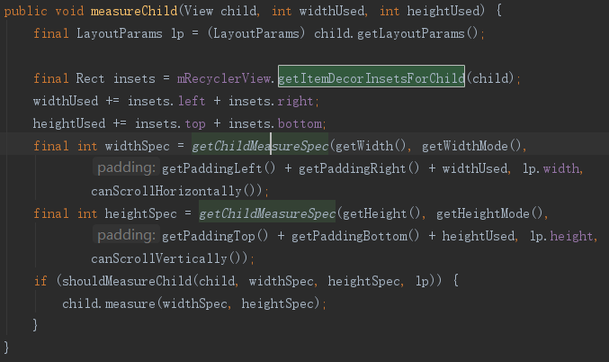


&emsp;&emsp;而继续跟踪发现`measureChild()`方法会调用`getItemDecorInsetsForChild()`，`measureChild()`方法的意思就是测量item的高度，之前我们学习`onMeasure`方法的时候会说父控件调用子控件的`measure()`方法时会传入父控件的测量建议（父控件剩余的宽高和测量模式），看下面的代码可以发现，剩余的宽高计算时会去除RecyclerView的Padding值和所有item间隔所占用的空间，所以RecyclerView的总宽高=Padding+所有item间隔+所有item的宽高，而`getItemOffsets()`中为outRect设置设置的left、top、right、bottom值将会加到item对应的padding中去，下面我们看看重写`getItemOffsets()`后的效果。

```Java
public void getItemOffsets(Rect outRect, View view, RecyclerView parent, RecyclerView.State state) {
    if (mOrientation == VERTICAL_LIST) {
        outRect.set(20, 40, 60, 80);
    } else {
        outRect.set(20, 40, 60, 80);
    }
}
```
&emsp;&emsp;&emsp;&emsp;&emsp;&emsp;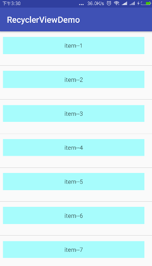

###3.2.onDraw() & onDrawOver()
&emsp;&emsp;ItemDecoration的onDraw()会在item的onDraw()方法之前执行，ItemDecoration的onDrawOver()会在item的onDraw()方法之后执行。这样的关系会导致绘制层级，ItemDecoration的onDraw()绘制在最底层，item在中间，onDrawOver()绘制在最上面。下面看看全部代码及效果图：

```Java
public class MyDividerItemDecoration extends RecyclerView.ItemDecoration{
    private static final int[] ATTRS = new int[]{
            android.R.attr.listDivider
    };
    public static final int HORIZONTAL_LIST = LinearLayoutManager.HORIZONTAL;
    public static final int VERTICAL_LIST = LinearLayoutManager.VERTICAL;
    /**用于绘制间隔样式*/
    private Drawable mDivider;
    /**列表的方向，水平/竖直 */
    private int mOrientation;

    private Paint paint;
    private Bitmap bitmap;

    public MyDividerItemDecoration(Context context, int orientation) {
        // 获取默认主题的属性
        final TypedArray a = context.obtainStyledAttributes(ATTRS);
        mDivider = a.getDrawable(0);
        a.recycle();
        setOrientation(orientation);

        paint = new Paint();
        paint.setAntiAlias(true);
        bitmap = BitmapFactory.decodeResource(context.getResources(), R.drawable.cat);
    }

    private void setOrientation(int orientation) {
        if (orientation != HORIZONTAL_LIST && orientation != VERTICAL_LIST) {
            throw new IllegalArgumentException("invalid orientation");
        }
        mOrientation = orientation;
    }
    @Override
    public void getItemOffsets(Rect outRect, View view, RecyclerView parent, RecyclerView.State state) {
        if (mOrientation == VERTICAL_LIST) {
            outRect.set(20, 40, 60, 80);
        } else {
            outRect.set(20, 40, 60, 80);
        }
    }
    /**onDraw方法会在item绘制之前调用，这里用来绘制item的间隔，可能会被item遮挡 */
    @Override
    public void onDraw(Canvas c, RecyclerView parent, RecyclerView.State state) {
        if (mOrientation == VERTICAL_LIST) {
            //获取分隔线左右坐标
            final int left = parent.getPaddingLeft();   //RecyclerView的左padding值
            final int right = parent.getWidth() - parent.getPaddingRight();  //RecyclerView减去right padding值后右边坐标
            final int childCount = parent.getChildCount();
            for (int i = 0; i < childCount; i++) {
                final View child = parent.getChildAt(i);
                final RecyclerView.LayoutParams params = (RecyclerView.LayoutParams) child.getLayoutParams();
                //分割线绘制的top位置=item底端+item底部margin值+item偏移量 - 20
                final int top = child.getBottom() + params.bottomMargin +
                        Math.round(ViewCompat.getTranslationY(child))-20;
                //分割线底部 = top + 20的overdraw + 底部80偏移值
                final int bottom = top + 20 + 80;
                mDivider.setBounds(left, top, right, bottom);
                mDivider.draw(c);
            }
        } else {
           //此处绘制水平方向排列时的间隔样式，省略
        }
    }
    /**onDrawOver方法会在item绘制之后调用，这层绘制将会显示在最上层 */
    @Override
    public void onDrawOver(Canvas c, RecyclerView parent, RecyclerView.State state) {
        if (mOrientation == VERTICAL_LIST) {
            final int childCount = parent.getChildCount();
            for (int i = 0; i < childCount; i++) {
                final View child = parent.getChildAt(i);
                //在item的头部画一只猫
                c.drawBitmap(bitmap, new Rect(0, 0,bitmap.getWidth(), bitmap.getHeight()),
                        new Rect(child.getLeft()+20, child.getTop(),
                                child.getLeft()+20+(child.getBottom()-child.getTop()),
                                child.getBottom()),paint);
            }
        } else {
            //此处绘制水平方向排列时的遮罩，省略
        }
    }
}
```

&emsp;&emsp;&emsp;&emsp;&emsp;&emsp;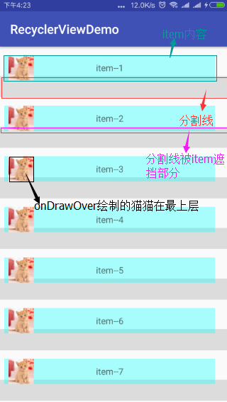


&emsp;&emsp;上面的实现效果基本上将三个方法的作用及使用场景都说明白了，效果图看起来很丑，不过这都没关系，只要弄明白其原理，想弄成什么样子都可以的。

##4、动画
&emsp;&emsp;通过`RecyclerView.setItemAnimator()`可以设置item的动画（item添加、删除、修改变换的动画），该方法接受一个`RecyclerView.ItemAnimator`对象，同样系统为我们提供了一个默认的实现类**DefaultItemAnimator**，DefaultItemAnimator中实现了add、remove、move、change四种动画，下面我们看看怎么使用：

###4.1. 系统提供的默认动画实现

①、设置Item动画

```Java
recyclerView.setItemAnimator(new DefaultItemAnimator());
```

②、adapter中编写添加或者删除item的方法

```Java
public void addData(int position,T t){
    if(null!=mDatas) {
        mDatas.add(position, t);
        notifyItemInserted(position);
        if (position != mDatas.size()) {
            //刷新改变位置item下方的所有Item的位置,避免索引错乱
            notifyItemRangeChanged(position, mDatas.size() - position);
        }
    }
}
public void removeData(int position){
    if(null!=mDatas && mDatas.size()>position) {
        mDatas.remove(position);
        notifyItemRemoved(position);
        if (position != mDatas.size()) {
            //刷新改变位置item下方的所有Item的位置,避免索引错乱
            notifyItemRangeChanged(position, mDatas.size() - position);
        }
    }
}
```

③、点击新增、长按删除

```Java
adapter = new CommandRecyclerAdapter<String>
        (this, R.layout.item_vertical, dataList) {
    @Override
    public void convert(ViewHolder holder, String str) {
        holder.setText(R.id.tv_item, str);
    }
    //点击事件，在下方添加一个item
    @Override
    public void onItemClick(String str, int position) {
        Log.i(getClass().getSimpleName(), "添加item"+position);
        adapter.addData(position+1, "新添加的item--"+(position+1));
    }
    //长按事件，删除item
    @Override
    public boolean onItemLongClick(String data, int position) {
        adapter.removeData(position);
        return true;
    }
};
recyclerView.setAdapter(adapter);
```

&emsp;&emsp;&emsp;&emsp;&emsp;&emsp;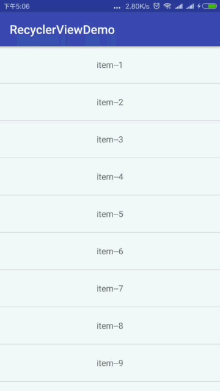


&emsp;&emsp;当数据集合发生变化后，不能用Adapter.notifyDataSetChanged()刷新，否则会导致动画不执行，要使用下面四个方法：

```Java
Adapter.notifyItemInserted(int position)
Adapter.notifyItemRemoved(int position)
Adapter.notifyItemChanged(int position)
Adapter.notifyItemMoved(int fromPosition, int  toPosition)
```

&emsp;&emsp;使用这四个方法只是视图上的变化，item的索引及ViewHolder的引用并没有刷新，这会导致位置错乱，调用上面方法后，需要使用下面的代码刷新变化的item下方所有item的位置，避免错乱。

```Java
if (position != mDatas.size()) {
    //刷新改变位置item下方的所有Item的位置,避免索引错乱
    notifyItemRangeChanged(position, mDatas.size() - position);
}
```

###4.2. 自定义动画效果
&emsp;&emsp;对于自定义的动画效果，官方没有给出相应的示例，我们看看`ItemAnimator`的代码何其子类的代码量也都不少，自己实现是不太可能，那能不能直接修改默认的动画效果呢？当然是可以的，此处我们创建一个类MyItemAnim复制`DefaultItemAnimator`的源码，稍作修改。`DefaultItemAnimator`中涉及到动画的关键方法有下面八个,分别对应添加、删除、移动和修改动画：

```Java
animateAdd()
animateAddImpl()

animateRemove()
animateRemoveImpl()

animateMove()
animateMoveImpl()

animateChange()
animateChangeImpl()
```

&emsp;&emsp;我们挑选add动画修改一下（在之前的源码上添加平移的动画）：

```Java
@Override
public boolean animateAdd(final RecyclerView.ViewHolder holder) {
   //重置动画，将itemView置为准备添加的状态
   resetAnimation(holder);
   ViewCompat.setAlpha(holder.itemView, 0);
   //在透明度变化的基础上添加一个平移动画，初始位置为左侧不可见
   ViewCompat.setTranslationX(holder.itemView,-holder.itemView.getWidth());
   mPendingAdditions.add(holder);
   return true;
}

void animateAddImpl(final RecyclerView.ViewHolder holder) {
   final View view = holder.itemView;
   final ViewPropertyAnimator animation = view.animate();
   mAddAnimations.add(holder);
   //在之前基础上添加平移动画，从-item.getWidth移动到0的位置
   animation.alpha(1).translationX(0).setDuration(getAddDuration())
           .setListener(new AnimatorListenerAdapter() {
               @Override
               public void onAnimationStart(Animator animator) {
                   dispatchAddStarting(holder);
               }

               @Override
               public void onAnimationCancel(Animator animator) {
                   view.setAlpha(1);
               }

               @Override
               public void onAnimationEnd(Animator animator) {
                   animation.setListener(null);
                   dispatchAddFinished(holder);
                   mAddAnimations.remove(holder);
                   dispatchFinishedWhenDone();
               }
           }).start();
}
```

&emsp;&emsp;使用自定义的动画：

```Java
// 设置Item添加和移除的动画
MyItemAnim anim = new MyItemAnim();
//设置动画持续时间
anim.setAddDuration(1500);
recyclerView.setItemAnimator(anim);
```

&emsp;&emsp;&emsp;&emsp;&emsp;&emsp;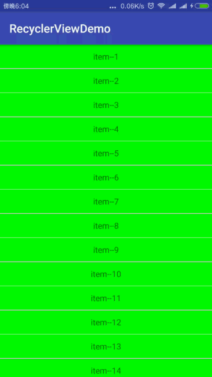


##5、三种布局管理器

RecyclerView提供了三种布局管理器：

* **LinerLayoutManager** 以垂直或者水平列表方式展示item
* **GridLayoutManager **以网格方式展示item
* **StaggeredGridLayoutManager** 以瀑布流方式展示item

###5.1.LinerLayoutManager
&emsp;上面的示例中都使用的是LinerLayoutManager，接下来我们看看GridLayoutManager和StaggeredGridLayoutManager。

###5.2.GridLayoutManager

&emsp;GridLayoutManager是网格样式的管理器，其效果与GridView差不多，它有三个构造方法，其中常用的有两个：

```Java
//默认竖直排列，spanCount为列数
GridLayoutManager(Context context, int spanCount)
//指定排列方向HORIZONTAL or  VERTICAL，reverseLayout表示是否倒序，如果设置为true，将从数据集合的最后一个开始拍
GridLayoutManager(Context context, int spanCount, int orientation, boolean reverseLayout)
```

&emsp;&emsp;第一个构造方法相当于GridLayoutManager(context, spanCount, VERTICAL, false)，我们使用第二个构造方法分别看看
竖直排列和水平排列的情况：

```Java
// 设置布局管理器
GridLayoutManager mGridtManager = new GridLayoutManager(this, 3, LinearLayoutManager.VERTICAL, false);
recyclerView.setLayoutManager(mGridtManager);
// 设置自定义间隔样式
recyclerView.addItemDecoration(new GridDividerDecoration(this));
```
```Java
// 设置布局管理器
GridLayoutManager mGridtManager = new GridLayoutManager(this, 3, LinearLayoutManager.HORIZONTAL, false);
recyclerView.setLayoutManager(mGridtManager);
// 设置自定义间隔样式
recyclerView.addItemDecoration(new GridDividerDecoration(this));
```

&emsp;&emsp;&emsp;&emsp;&emsp;&emsp;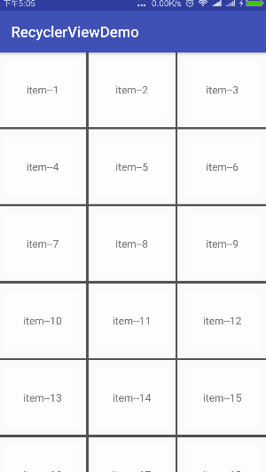&emsp;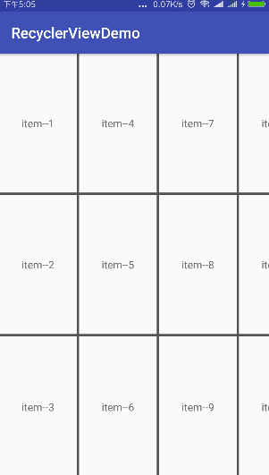


####5.2.1 .自定义定义间隔样式

&emsp;&emsp;使用起来还是很方便，但是发现系统没有提供默认的item分隔样式，如果使用DividerItemDecoration，只会在每行下面有一条分割线，所以我们要自己定义分割线。原理上面都说过，对于网格，我们只需要每个item的右下方留分割线就行了，但这样会产生一个问题，最后一列的右侧会有间隔，有两种方法解决：

* 第一种：只需要给RecyclerView设置top和left方向的padding值，正好和间隔宽度一致就行
* 第二种：通过item的position判断如果处于最后一列，则只在bottom方向留间隔

&emsp;&emsp;水平排列的情况也是一样的，就不多说。我们利用第二种思路定义自己的间隔格式，核心代码如下：
```Java
/**
* 由于grid网格特性，需要相邻的item之间隔开，所以只需要在右下方留间隔
* 但是特殊item需要特殊对待，比如最后一列、最后一行的情况
*/
@Override
public void getItemOffsets(Rect outRect, View view, RecyclerView parent, RecyclerView.State state) {
   int spanCount = ((GridLayoutManager) parent.getLayoutManager()).getSpanCount();
   int orientation = ((GridLayoutManager)parent.getLayoutManager()).getOrientation();
   int position = parent.getChildLayoutPosition(view);
   boolean rightSpace = true;   //是否在右侧留间隔
   boolean bottomSpace = true;  //是否在下方留间隔
   if(orientation == OrientationHelper.VERTICAL){   //竖直排列的情况
       if ((position + 1) % spanCount == 0)
           rightSpace = false;   //最后一列只需要bottom方向留间隔
       else { //前面的列在right和bottom方向留间隔
       }
   }else if(orientation == OrientationHelper.HORIZONTAL){   //水平排列的情况
       if ((position + 1) % spanCount == 0)
           bottomSpace = false;  //最后一排只需要右边留间隔
       else {
           //前面的排在right和bottom方向留间隔
       }
   }
   outRect.set(0, 0, rightSpace?mDivider.getIntrinsicWidth() : 0, bottomSpace?mDivider.getIntrinsicHeight() : 0);
}

@Override
public void onDraw(Canvas canvas, RecyclerView parent, RecyclerView.State state) {
   // 绘制间隔，每一个item，绘制右边和下方间隔样式
   int childCount = parent.getChildCount();  //注意childCount是一屏显示的总数，而不是数据的总数
   int spanCount = ((GridLayoutManager)parent.getLayoutManager()).getSpanCount();
   int orientation = ((GridLayoutManager)parent.getLayoutManager()).getOrientation();
   boolean drawRight;
   boolean drawBottom;
   for(int i = 0; i < childCount; i++) {
       drawRight = drawBottom = true;
       if(orientation == OrientationHelper.VERTICAL){   //竖直排列的情况
           if ((i + 1) % spanCount == 0)
               drawRight = false;   //最后一列只需要bottom方向留间隔
           else { //前面的列在right和bottom方向留间隔
           }
       }else if(orientation == OrientationHelper.HORIZONTAL){   //水平排列的情况
           if ((i + 1) % spanCount == 0)
               drawBottom = false;  //最后一排只需要右边留间隔
           else {
               //前面的排在right和bottom方向留间隔
           }
       }

       View child = parent.getChildAt(i);
       RecyclerView.LayoutParams params = (RecyclerView.LayoutParams) child.getLayoutParams();
       if(drawRight) {
           int left = child.getRight() + params.rightMargin;
           int top = child.getTop() - params.topMargin;
           int right = left + mDivider.getIntrinsicWidth();
           int bottom = child.getBottom() + params.bottomMargin + mDivider.getIntrinsicHeight();
           mDivider.setBounds(left, top, right, bottom);
           mDivider.draw(canvas);
       }
       if(drawBottom){
           int left = child.getLeft() - params.leftMargin;
           int top = child.getBottom() + params.bottomMargin;
           int right = child.getRight() + params.rightMargin;
           int bottom = top + mDivider.getIntrinsicHeight();
           mDivider.setBounds(left, top, right, bottom);
           mDivider.draw(canvas);
       }
       Log.w(getClass().getSimpleName(),
               "第"+i+"个item "+"  drawRight="+drawRight+"  drawBottom="+drawBottom);
   }
}
```

###5.3.StaggeredGridLayoutManager

&emsp;&emsp;使用`StaggeredGridLayoutManager`可以很方便的实现瀑布流布局，其构造方法`StaggeredGridLayoutManager(int spanCount, int orientation)`，spanCount代表每行或每列的Item个数，orientation代表列表的方向，竖直或者水平，限于篇幅我们就看看竖直方向的情况。

&emsp;&emsp;瀑布流和网格略有不同，每个item的高度不一定是一样的，所以我们需要准备多种高度的item，还需要在adapter中根据item类型分别加载：

_item_staggered_1.xml 和 item_staggered_2.xml_
```xml
<?xml version="1.0" encoding="utf-8"?>
<LinearLayout xmlns:android="http://schemas.android.com/apk/res/android"
    android:orientation="vertical"
    android:layout_width="match_parent"
    android:layout_height="85dip"
    android:background="#aa000000"
    android:paddingBottom="5dp"
    android:paddingRight="5dp">
    <TextView
        android:id="@+id/tv_item"
        android:layout_width="match_parent"
        android:layout_height="match_parent"
        android:background="#ffffff"
        android:gravity="center"/>
</LinearLayout>
```
```xml
<?xml version="1.0" encoding="utf-8"?>
<LinearLayout xmlns:android="http://schemas.android.com/apk/res/android"
    android:orientation="vertical"
    android:layout_width="match_parent"
    android:layout_height="120dip"
    android:paddingBottom="5dp"
    android:paddingRight="5dp"
    android:background="#aa000000">
    <TextView
        android:id="@+id/tv_item"
        android:layout_width="match_parent"
        android:layout_height="match_parent"
        android:background="#ffffff"
        android:gravity="center"/>
</LinearLayout>
```

Adapter中相关代码：
```Java
@Override
 public int getItemViewType(int position) {
     // 瀑布流样式外部设置spanCount为2，在这列设置两个不同的item type，以区分不同的布局
     return position % 2;
 }
 @Override
 public ViewHolder onCreateViewHolder(final ViewGroup parent, int viewType){
     ViewHolder viewHolder = ViewHolder.get(mContext, parent, mLayoutIds.get(viewType));
     return viewHolder;
 }
```

Activity中：
```Java
List<Integer> itemLayouts = new ArrayList<>();
itemLayouts.add(R.layout.item_staggered_1);
itemLayouts.add(R.layout.item_staggered_2);
recyclerView = findViewById(R.id.recyclerView);
StaggeredGridLayoutManager manager = new StaggeredGridLayoutManager
        (2, OrientationHelper.VERTICAL);
recyclerView.setLayoutManager(manager);
adapter = new CommandRecyclerStaggeredAdapter<String>
        (this, itemLayouts, dataList) {
    @Override
    public void convert(ViewHolder holder, String str) {
        holder.setText(R.id.tv_item, str);
    }
    @Override
    public void onItemClick(String str, int position) {
    }
};
recyclerView.setAdapter(adapter);
```

效果图：
&emsp;&emsp;&emsp;&emsp;&emsp;&emsp;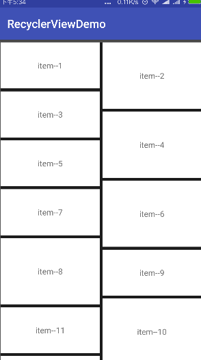


&emsp;&emsp;我们上面的代码中并没有设置分隔线样式，为什么会有分割线呢？瀑布流的分割线和列表、网格有所不同，瀑布流中item的位置不是死的，相对灵活，比如图中的item8按道理应该在右边，为什么跑到左边了呢？瀑布流在大体方向上是从上往下、从左到右的顺序，但还有一个高度低洼优先排列的规律，item8在安排位置的时候发现左边高度比右边低，则会在左边添加item8，如果有多列就会在高度最低的那列摆放下一个item。

&emsp;&emsp;这样我们就不能根据position确定item的具体位置,就无法通过上面的方式自定义间隔样式了，不过我们可以想其他办法，比如上面的item布局中，我们直接为item的paddingBottom和paddingRight，这样每个item之间就有间隔了。但是问题产生了，这样的话左边没有间隔，最右边有间隔，我们可以在RecyclerView上设置paddingLeft就能解决了。
```Java
<android.support.v7.widget.RecyclerView xmlns:android="http://schemas.android.com/apk/res/android"
    android:id="@+id/recyclerView"
    android:paddingLeft="5dip"
    android:background="#aa000000"
    android:layout_width="match_parent"
    android:layout_height="match_parent" />
```